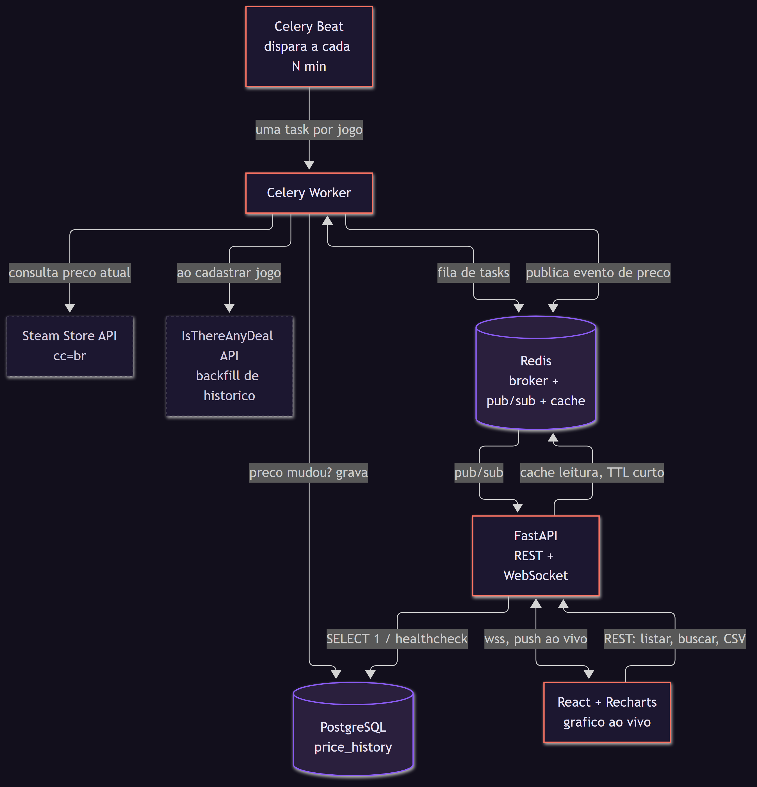
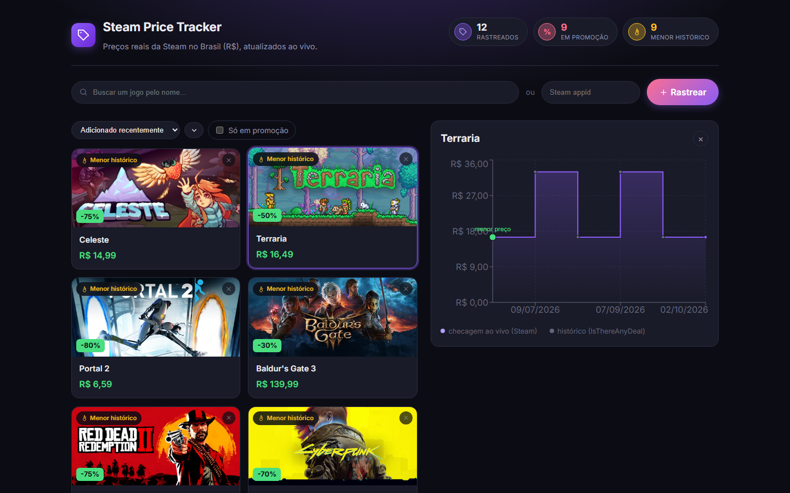
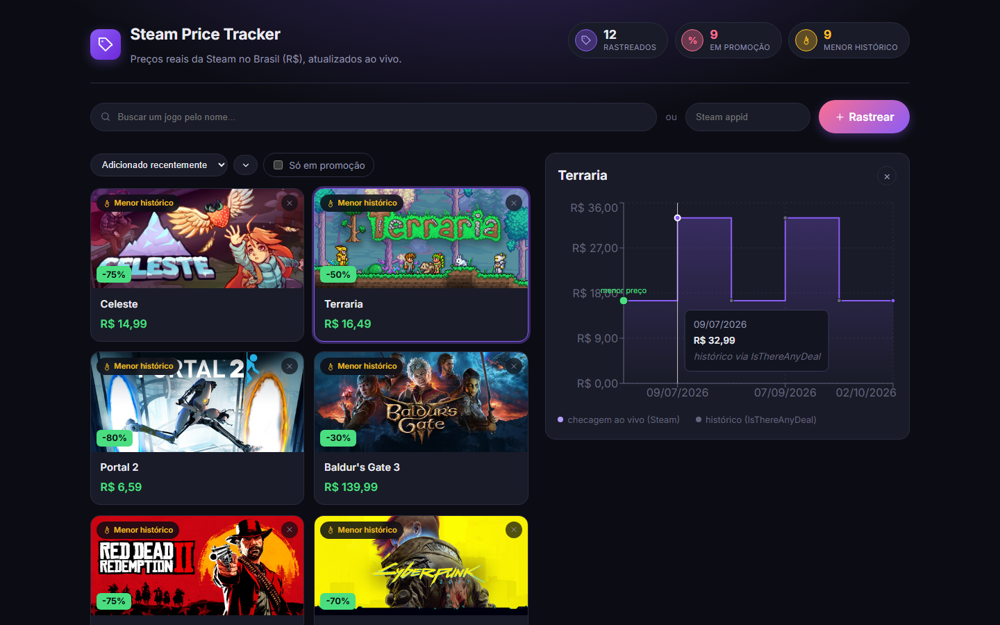
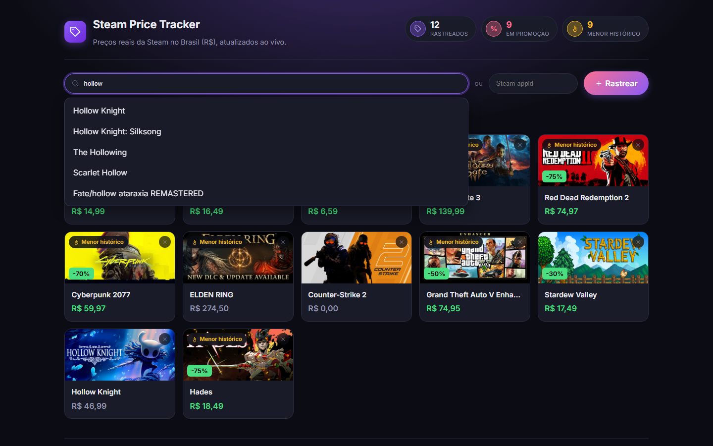
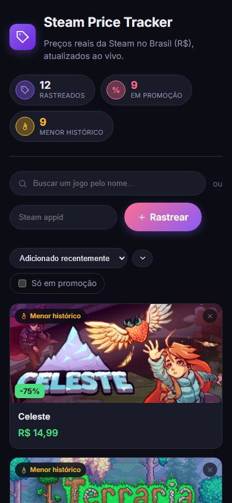
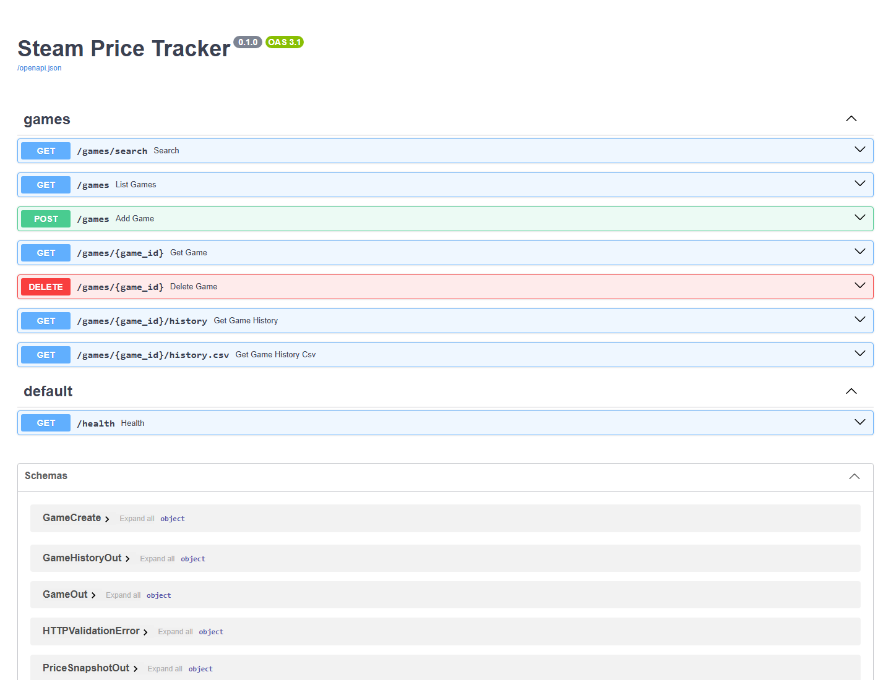

# Steam Price Tracker


Rastreador de preços de jogos da Steam **em reais (R$)**, com histórico de preço real e atualização ao vivo via WebSocket. Preços reais cobrados pela Steam no Brasil (não conversão por câmbio) — a consulta usa `cc=br` na API da Steam.


> **Sem demo pública ao vivo — de propósito, não por limitação.** Ver [por que](#por-que-não-tem-um-link-ao-vivo) antes de achar que é só preguiça de fazer deploy.

## Rodando localmente (2 comandos)

```bash
cp .env.example .env
docker compose up --build
```

- API: http://localhost:8000/docs
- Frontend: http://localhost:5173

Depois, popule com ~12 jogos populares e histórico de preço real (ver [Populando com dados de exemplo](#populando-com-dados-de-exemplo)) para ver a tela exatamente como nos prints abaixo.

---

## Como funciona



- **FastAPI**: API REST para adicionar/listar/filtrar jogos e consultar histórico de preço, com WebSocket para push de atualizações em tempo real. Docs automáticas em `/docs`.
- **Celery + Redis**: job periódico (Celery Beat) dispara uma task por jogo rastreado; cada task consulta a Steam, compara com o último preço salvo (dedup/idempotência: só grava se mudou) e publica o evento no Redis se o preço mudar. Falhas de rede na Steam acionam retry com backoff exponencial.
- **PostgreSQL**: histórico de preços como série temporal (`price_history`), indexado por jogo + data.
- **IsThereAnyDeal**: ao cadastrar um jogo, o backend importa automaticamente os últimos meses de preço real da Steam via API do ITAD, então o gráfico já nasce com histórico — não com um único ponto vazio.
- **Frontend (React + Recharts)**: busca jogo por nome ou appid, lista jogos rastreados com preço atual, gráfico de histórico que atualiza sozinho quando um preço muda (sem dar refresh).

## Prints

<table>
<tr>
<td width="50%">

**Painel de detalhe do jogo**, com gráfico diferenciando pontos de checagem ao vivo (Steam) de histórico importado (IsThereAnyDeal):



</td>
<td width="50%">

**Tooltip do gráfico**, mostrando desconto % vs. preço cheio e a fonte do dado:



</td>
</tr>
<tr>
<td width="50%">

**Busca com autocomplete**, direto na API pública da Steam:



</td>
<td width="50%">

**Responsivo mobile**:



</td>
</tr>
</table>

**Documentação automática da API** (Swagger/OpenAPI, gerada pelo FastAPI sem esforço manual):



---

## Decisões de arquitetura

Trechos que acho que valem explicação — o "por quê", não só o "o quê".

**Redis com dois papéis (broker do Celery + pub/sub de eventos) e também um terceiro: cache.**
Em vez de outro serviço só para notificar o frontend quando um preço muda, o worker Celery publica o evento no mesmo Redis que já usa como broker. O FastAPI escuta esse canal e repassa via WebSocket. Depois, o Redis ganhou um terceiro papel: cache de leitura com TTL curto (`app/cache.py`) nas chamadas à Steam, para não bater na API externa a cada requisição de usuário — com fallback gracioso (`except redis.RedisError`) para nunca deixar uma falha do Redis derrubar uma checagem de preço.

**Celery Beat e Worker são processos separados, não um só.**
O Beat só agenda (processo leve, sem fazer chamada de rede nenhuma); o Worker executa. Separar os dois é o padrão de produção do Celery — evita que um agendamento atrasado trave a execução, e permite escalar workers independentemente do agendador.

**`Base.metadata.create_all` roda no lifespan do FastAPI, não no import do módulo.**
Importar `app.main` (como os testes fazem) não deveria exigir um Postgres vivo. Criar o schema só quando a aplicação de fato sobe evita acoplar os testes unitários a infraestrutura externa — os testes rodam contra SQLite em memória, isolados.

**`PriceAlert` é uma tabela própria, não uma coluna nullable em `Game`.**
Um alerta de preço tem ciclo de vida (criado → disparado → limpo) que uma coluna solta não representa bem. A tabela já está no schema (`backend/app/models.py`), pensada para quando o fluxo de e-mail for implementado (ver [roadmap](#o-que-não-foi-construído-de-propósito)).

**A fonte do histórico de preço é um campo explícito (`source: "steam_live" | "itad_backfill"`), não dado misturado silenciosamente.**
A Steam não expõe histórico de preço — só o preço atual. Para o gráfico não nascer vazio ao cadastrar um jogo, o backend busca os últimos meses via [IsThereAnyDeal](https://docs.isthereanydeal.com/). Antes de confiar nesse dado, testei empiricamente contra a API real (Elden Ring, GTA V, Hades, Stardew Valley, Cyberpunk 2077, Hollow Knight): filtrando por `shops=61` (id da Steam no ITAD) + `country=br`, o preço vem **sempre em BRL**, sem mistura de moeda — então não precisei inventar lógica de conversão por câmbio (o que teria dado um preço que a Steam nunca cobrou de verdade). Cada ponto do gráfico carrega sua fonte, visível no tooltip.

**Rate limiting nas duas rotas que chamam API externa, não no resto.**
`POST /games` e `/games/search` tocam a API da Steam/ITAD — são as rotas que um scraper ou bot abusaria para esgotar a cota gratuita dessas APIs. As demais rotas só leem do próprio banco, então rate limit ali seria proteção sem necessidade real.

**Health check de verdade, não um 200 fixo.**
`/health` roda `SELECT 1` no Postgres e `PING` no Redis de verdade, e retorna 503 se algo falhar. Um health check que sempre responde 200 é pior que não ter nenhum — esconde outage em vez de expor.

**Logging estruturado (`structlog`, JSON) com `request_id` por requisição, correlacionando API e worker.**
Logs em texto livre são inúteis para grep em produção. Cada requisição HTTP ganha um `request_id` via `structlog.contextvars`, propagado pelos logs daquela requisição — e o mesmo setup (`configure_logging()`) roda tanto no processo da API quanto nos processos separados de worker/beat, que nunca importam `main.py`.

## Por que não tem um link ao vivo

Cheguei a planejar deploy em Railway (backend+worker+beat+Postgres+Redis) + Vercel (frontend). No caminho, descobri que **nenhuma das duas opções mais óbvias é realmente gratuita pra manter 3 processos sempre ativos**:

- Railway trocou o tier gratuito indefinido por um crédito único de $5 (30 dias) — depois disso, o plano mínimo é **$5/mês**.
- AWS trocou, em julho de 2025, os 12 meses grátis de EC2/RDS por um crédito único de **$200 válido por 6 meses** — depois disso, EC2+RDS+ElastiCache voltam a cobrar normal (a parte "sempre grátis" da AWS é só Lambda/DynamoDB, o que exigiria reescrever o projeto inteiro em serverless, jogando fora a demonstração de fila assíncrona real com Celery).

Pra um projeto que existe como **demonstração de portfólio**, pagar uma mensalidade recorrente por um link que só precisa estar no ar enquanto alguém está olhando não fez sentido — o dinheiro não compra nada que o código já não prove. Preferi investir esse tempo em deixar a documentação, os prints e as decisões de arquitetura claras o suficiente para que rodar `docker compose up` (2 comandos, 2 minutos) seja a barreira real, não a única forma de avaliar o projeto.

Se isso for um bloqueio pra quem está avaliando, me procura — rodo uma demo ao vivo numa chamada em minutos.

## Por que construí isso

Queria um projeto que não fosse só CRUD com gráfico: algo com fila assíncrona de verdade (Celery, não um `setInterval`), WebSocket real, integração com API externa de terceiros validada empiricamente (não assumida), e as decisões de produção (health check, rate limit, cache, logging estruturado) que normalmente só aparecem em projeto de trabalho, não em projeto de portfólio.

## O que não foi construído de propósito

- **Alertas de preço por e-mail**: a tabela `PriceAlert` já existe no schema, mas o fluxo completo (CRUD, comparação no worker, envio via Resend) ficou de fora por escopo/tempo — não por dificuldade técnica.
- **Importar wishlist/biblioteca da Steam**: a feature mais "uau" possível, mas também a mais trabalhosa (perfis privados, paginação) — deixada como próximo passo claro em vez de meio-implementada.
- **Métricas com Prometheus + Grafana**: dashboard de latência da Steam API e taxa de erro por checagem. Item mais caro da lista — só compensaria com o resto já consolidado.
- **Autenticação multi-usuário**: viraria outro projeto inteiro (login, sessão, isolamento de dados). Deliberadamente fora de escopo para manter o projeto focado.

## Populando com dados de exemplo

Com a stack rodando (`docker compose up --build`), popule o banco com ~12 jogos populares (CS2, GTA V, Elden Ring, Hollow Knight, Stardew Valley, Hades, Cyberpunk 2077, RDR2, Baldur's Gate 3, Portal 2, Terraria, Celeste) — incluindo histórico de preço real dos últimos meses via [IsThereAnyDeal](https://isthereanydeal.com), não só um snapshot vazio:

```bash
docker compose exec api python -m scripts.seed
```

Idempotente: jogos já cadastrados são pulados.

## Rodando localmente sem Docker

**Backend** (precisa de PostgreSQL e Redis rodando):

```bash
cd backend
python -m venv venv
venv\Scripts\activate          # Windows
pip install -r requirements-dev.txt
cp ../.env.example .env        # ajuste DATABASE_URL/REDIS_URL para localhost
uvicorn app.main:app --reload
```

Em outros dois terminais, dentro de `backend/` com o venv ativo:

```bash
celery -A app.celery_app worker --loglevel=info
celery -A app.celery_app beat --loglevel=info
```

**Frontend:**

```bash
cd frontend
npm install
npm run dev
```

## Testes

```bash
cd backend
pytest -q                              # 28 testes, mockando Steam/ITAD (não bate nas APIs de verdade)
pytest -q --cov=app --cov-report=term-missing   # com relatório de cobertura
ruff check .
```

## Stack

Python · FastAPI · Celery · Redis · PostgreSQL · SQLAlchemy · structlog · slowapi · pytest · Docker · React · Vite · Recharts · GitHub Actions
